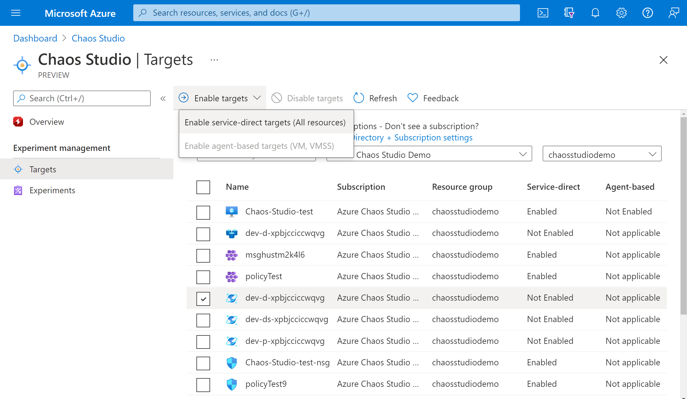
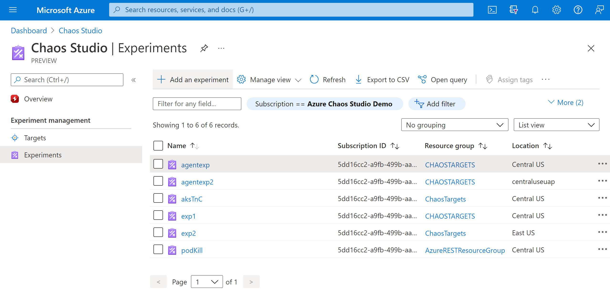
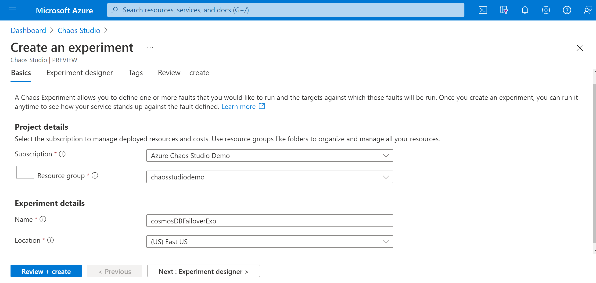
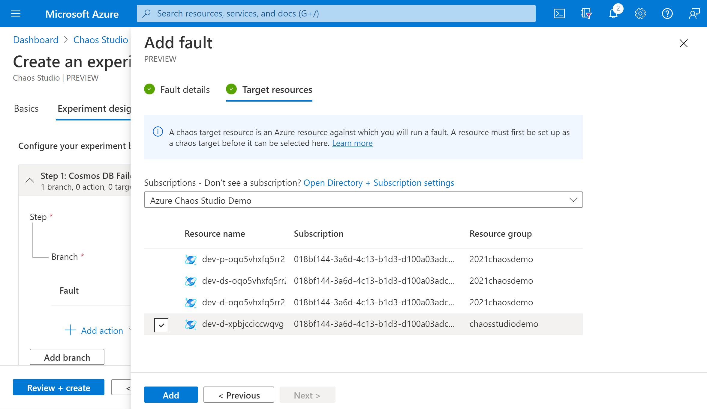
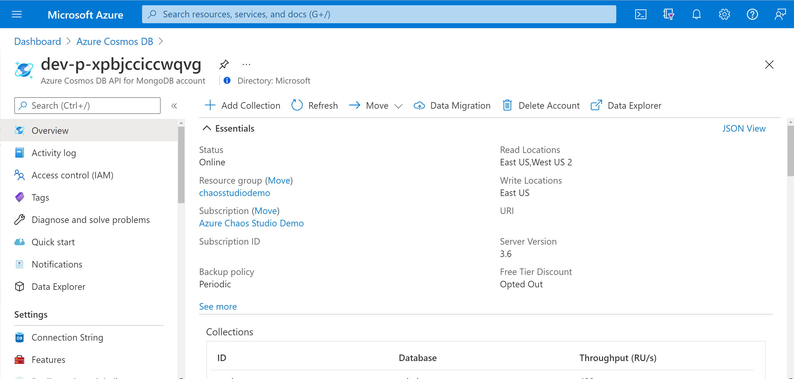
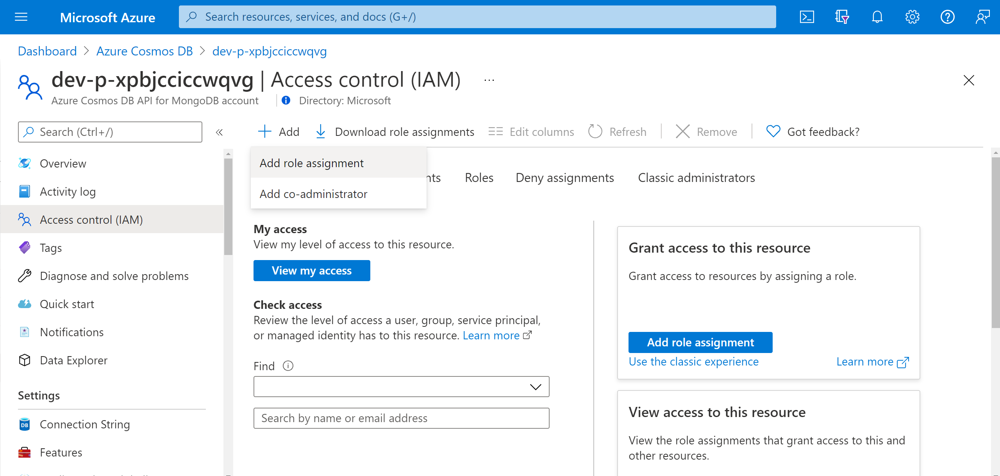
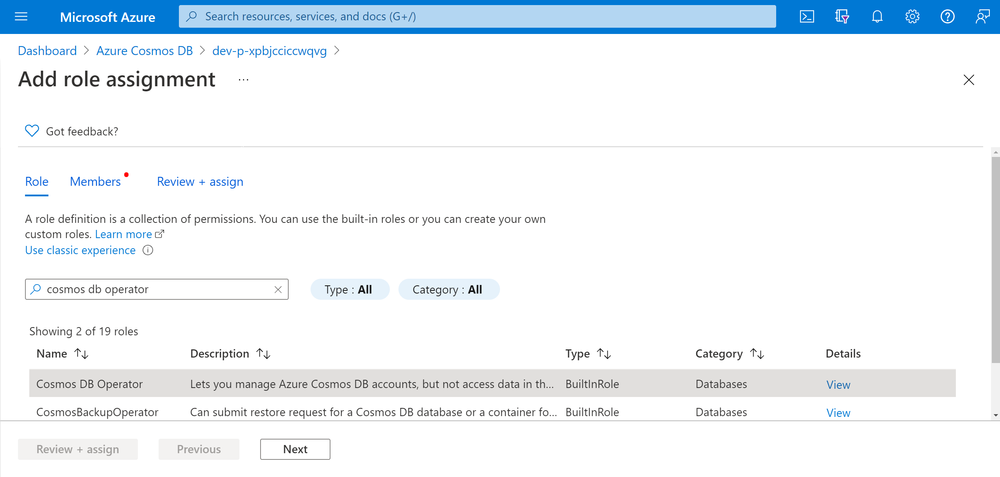
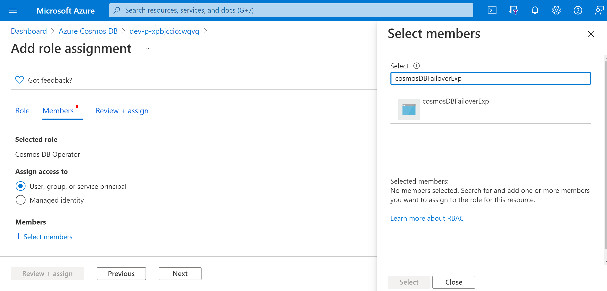

# Create a chaos experiment that uses a service-direct fault to fail over an Azure Cosmos DB instance

You can use a chaos experiment to verify that your application is resilient to failures by causing those failures in a controlled environment. In this article, you cause a multi-read, single-write Azure Cosmos DB failover by using a chaos experiment and Azure Chaos Studio. Running this experiment can help you defend against data loss when a failover event occurs.

You can use these same steps to set up and run an experiment for any service-direct fault. A *service-direct* fault runs directly against an Azure resource without any need for instrumentation. Agent-based faults require installation of the chaos agent.

## Prerequisites

- An Azure subscription. [!INCLUDE [quickstarts-free-trial-note](~/reusable-content/ce-skilling/azure/includes/quickstarts-free-trial-note.md)]
- An Azure Cosmos DB account. If you don't have an Azure Cosmos DB account, follow these steps to [create one](/azure/cosmos-db/sql/create-cosmosdb-resources-portal).
- At least one read and one write region setup for your Azure Cosmos DB account.

## Enable Chaos Studio on your Azure Cosmos DB account

Chaos Studio can't inject faults against a resource unless that resource is added to Chaos Studio first. You add a resource to Chaos Studio by creating a [target and capabilities](chaos-studio-targets-capabilities.md) on the resource. Azure Cosmos DB accounts have only one target type (service-direct) and one capability (failover). Other resources might have up to two target types. One target type is for service-direct faults. Another target type is for agent-based faults. Other resources might have many other capabilities.

1. Open the [Azure portal](https://portal.azure.com).
1. Search for **Chaos Studio** in the search bar.
1. Select **Targets** and go to your Azure Cosmos DB account.

   
1. Select the checkbox next to your Azure Cosmos DB account. Select **Enable targets** and then select **Enable service-direct targets** from the dropdown menu.

   

1. Confirm that the desired resource is listed. Select **Review + Enable**, then **Enable**. 

1. A notification appears that indicates that the resources selected were successfully enabled.

   

You've now successfully added your Azure Cosmos DB account to Chaos Studio. In the **Targets** view, you can also manage the capabilities enabled on this resource. Selecting the **Manage actions** link next to a resource displays the capabilities enabled for that resource.

## Create an experiment
Now you can create your experiment. A chaos experiment defines the actions you want to take against target resources. The actions are organized and run in sequential steps. The chaos experiment also defines the actions you want to take against branches, which run in parallel.

1. Select the **Experiments** tab in Chaos Studio. In this view, you can see and manage all your chaos experiments. Select **Create** > **New experiment**.

   
1. Fill in the **Subscription**, **Resource Group**, and **Location** where you want to deploy the chaos experiment. Give your experiment a name. Select **Next: Experiment designer**.

   
1. You're now in the Chaos Studio experiment designer. The experiment designer allows you to build your experiment by adding steps, branches, and faults. Give a friendly name to your **Step** and **Branch** and select **Add action > Add fault**.

   
1. Select **CosmosDB Failover** from the dropdown list. Fill in **Duration** with the number of minutes you want the failure to last and **readRegion** with the read region of your Azure Cosmos DB account. Select **Next: Target resources**.

   
1. Select your Azure Cosmos DB account and select **Next**.

   
1. Verify that your experiment looks correct and select **Review + create** > **Create**.

   

## Give the experiment permission to your target resource
When you create a chaos experiment, Chaos Studio creates a system-assigned managed identity that executes faults against your target resources. This identity must be given [appropriate permissions](chaos-studio-fault-providers.md) to the target resource for the experiment to run successfully. You can use these steps for any resource and target type by modifying the role assignment in step 3 to match the [appropriate role for that resource and target type.](chaos-studio-fault-providers.md).

1. Go to your Azure Cosmos DB account and select **Access control (IAM)**.

   
1. Select **Add** > **Add role assignment**.

   
1. Search for **Cosmos DB Operator** and select the role. Select **Next**.

   
1. Choose **Select members** and search for your experiment name. Select your experiment and choose **Select**. If there are multiple experiments in the same tenant with the same name, your experiment name is truncated with random characters added.

   
1. Select **Review + assign** > **Review + assign**.

## Run your experiment
You're now ready to run your experiment. To see the effect, we recommend that you open your Azure Cosmos DB account overview and go to **Replicate data globally** in a separate browser tab. Refreshing periodically during the experiment shows the region swap.

1. In the **Experiments** view, select your experiment. Select **Start** > **OK**.
1. When **Status** changes to *Running*, select **Details** for the latest run under **History** to see details for the running experiment.

## Next steps
Now that you've run an Azure Cosmos DB service-direct experiment, you're ready to:
- [Create an experiment that uses agent-based faults](chaos-studio-tutorial-agent-based-portal.md)
- [Manage your experiment](chaos-studio-run-experiment.md)
