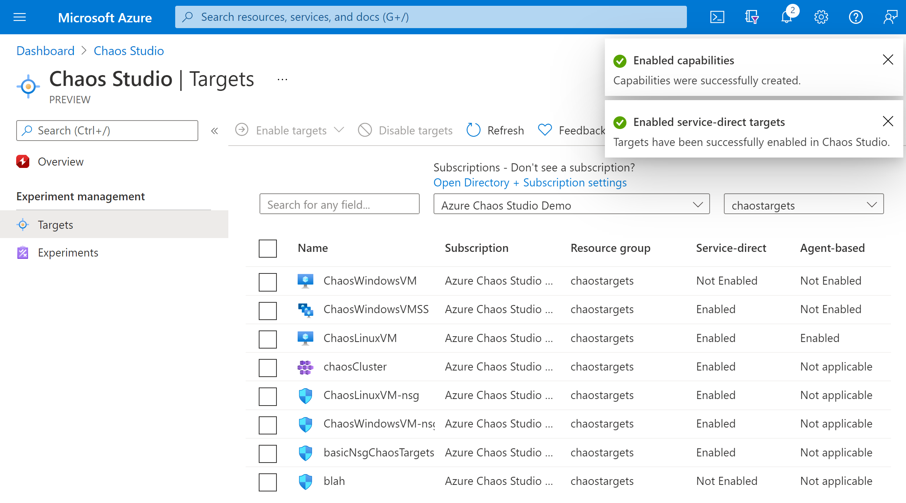
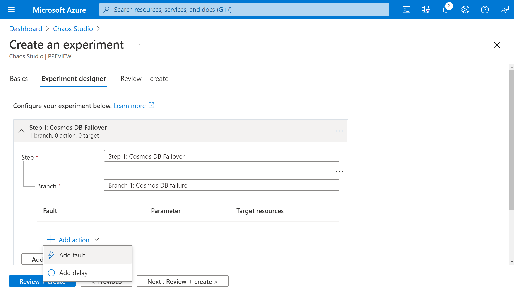

# Create a chaos experiment that uses a service-direct fault to fail over a Cosmos DB instance

You can use a chaos experiment to verify that your application is resilient against failures by causing those failures in a controlled environment. In this guide, you will cause a multi-read, single-write Comos DB failover using a chaos experiment and Azure Chaos Studio. Running this experiment can help you defend against data loss when a failover event occurs.

These same steps can be used to setup and run an experiment for any service-direct fault. A **service-direct** fault runs directly against an Azure resource without any need for instrumentation, unlike agent-based faults which require installation of the chaos agent.

## Prerequisites

- An Azure subscription. [!INCLUDE [quickstarts-free-trial-note](../../../includes/quickstarts-free-trial-note.md)] 
- A Cosmos DB account. If you do not have a Cosmos DB account, you can [follow these steps to create one](../cosmos-db/sql/create-cosmosdb-resources-portal).
- At least one read and one write region setup for your Cosmos DB account.

## Enable Chaos Studio on your Cosmos DB account

Chaos Studio cannot inject faults against a resource unless that resource has been onboarded to Chaos Studio first. You onboard a resource to Chaos Studio by creating a [target and capabilities](chaos-studio-targets-capabilities.md) on the resource. Cosmos DB accounts only have one target type (service-direct) and one capability (failover), but other resources may have up to two target types - one for service-direct faults and one for agent-based faults - and many capabilities.

1. Open the [Azure portal](https://portal.azure.com).
2. Search for **Chaos Studio (preview)** in the search bar.
3. Click on **Targets** and navigate to your Cosmos DB account.

4. Check the box next to your Cosmos DB account and click **Enable targets** then **Enable service-direct targets** from the dropdown menu.

5. A notification will appear indicating that the resource(s) selected were successfully enabled.

You have now successfully onboarded your Cosmos DB account to Chaos Studio. In the **Targets** view you can also manage the capabilities enabled on this resource. Clicking the **Manage actions** link next to a resource will display the capabilities enabled for that resource.

## Create an experiment
With your Cosmos DB account now onboarded, you can create your experiment. A chaos experiment defines the actions you want to take against target resources, organized into steps, which run sequentially, and branches, which run in parallel.

1. Click on the **Experiments** tab in the Chaos Studio navigation. In this view you can see and manage all of your chaos experiments. Click on **Add an experiment**

2. Fill in the **Subscription**, **Resource Group**, and **Location** where you want to deploy the chaos experiment. Give your experiment a **Name**. Click **Next : Experiment designer >**

3. You are now in the Chaos Studio experiment designer. The experiment designer allows you to build your experiment by adding steps, branches, and faults. Give a friendly name to your **Step** and **Branch**, then click **Add fault**.

4. Select **CosmosDB Failover** from the dropdown, then fill in the **Duration** with the number of minutes you want the failure to last and **readRegion** with the read region of your Cosmos DB account. Click **Next: Target resources >**

5. Select your Cosmos DB account, and click **Next**

6. Verify that your experiment looks correct, then click **Review + create**, then **Create.**

## Give experiment permission to your Cosmos DB account
When you create a chaos experiment, Chaos Studio creates a system-assigned managed identity that executes faults against your target resources. This identity must be given [appropriate permissions](chaos-studio-fault-providers.md) to the target resource for the experiment to run successfully.

1. Navigate to your Cosmos DB account and click on **Access control (IAM)**.

2. Click **Add** then click **Add role assignment**.

3. Search for **Cosmos DB Operator** and select the role. Click **Next**

4. Click **Select members** and search for your experiment name. Select your experiment and click **Select**. If there are multiple experiments in the same tenant with the same name, your experiment name will be truncated with random characters added.

5. Click **Review + assign** then **Review + assign**.

## Run your experiment
You are now ready to run your experiment. To see the impact, we recommend opening your Cosmos DB account overview and going to **Replicate data globally** in a separate browser tab. Refreshing periodically during the experiment will show the region swap.

1. In the **Experiments** view, click on your experiment, and click **Start**, then click **OK**.
2. When the **Status** changes to **Running**, click **Details** for the latest run under **History** to see details for the running experiment.

## Next steps
Now that you have run a Cosmos DB service-direct experiment, you are ready to:
- [Create an experiment that uses agent-based faults](chaos-studio-tutorial-agent-based.md)
- [Manage your experiment](chaos-studio-run-experiment.md)

